# Enabling Encryption at Rest with Harvester

This repo will cover the various cases of encryption at rest presented by the hyperconverged infrastructure product from SUSE Rancher named [Harvester](https://docs.harvesterhci.io/v1.2/).

## Introduction
Harvester leverages several open-source projects to provide hyperconverged infrastructure services. As we are focusing specifically on encryption at rest, I will focus upon the storage mechanism named [Longhorn](https://longhorn.io/docs/1.5.1/).

While Harvester does include Longhorn to manage all storage, it does not expose all configuration options to the user. This is done for stability reasons in that Harvester is built/tested with Longhorn used in a specific fashion. Stepping outside of that can cause issues that make supporting a product difficult.

One of those features not completely exposed as of `v1.2.1` is encryption at rest with Longhorn.

## Longhorn and Encryption at Rest

Longhorn has the capability of doing encryption at rest both globally and on a per volume level. The keys for encryption are stored in the longhorn namespace and mapped to new `StorageClass` objects that specify the encryption enable flags as well as the reference to the `Secret` object containing the symmetric key.

A brief introduction can be seen on the [Longhorn documentation page](https://longhorn.io/docs/1.5.1/advanced-resources/security/volume-encryption/)

## Differences with Harvester
While Harvester does include Longhorn storage classes, it also has to handle the case of virtual machine images for each VM. If I create a VM image to make available for VM creation, under the hood Harvester is creating a new StorageClass based on a backing baseline image. When I create the VM, the root filesystem uses this storage class for its volume type and the resulting PVC that gets created is a copy of the backing image.

The K8S CRD defining these VM images is a `VirtualMachineImage` and it contains within it a set of configuration options to feed into the resulting storage class that gets created. I can manually create a VMI from the K8S API and feed these config options manually. What should happen is those options eventually make it to the resulting `StorageClass` object that gets created, but that is not the case. The object as specified does not make it to etcd and appears to be stripped out.

## Capabilities as of 1.2.1

Where does this leave us? Encryption at Rest does work in Longhorn and is exposed as a `StorageClass` option, but VM images due to their multi-step process does not allow for this. Given that VMs can also include additional volumes based on direct storage classes, we should also be able to encrypt additional volumes.

Current capabilities:
* Encryption works for Containerized volumes (classic PVC in a K8S cluster)
* Encrytion works for additional VM volumes
* Encryption does NOT work for root filesystems for VMs

### Pre-Steps

WARNING: I am using a single Harvester node for this test, so volumes will highlight in yellow within the Longhorn UI as they do not have sufficient replica count to be counted as healthy (3).

Before testing any encryption capabilities, I need to create an [encryption key and configured storage class](yaml/encryption_enable.yaml). I will use the global key example from the longhorn docs.
```console
> kc apply -f yaml/encryption_enable.yaml
secret/longhorn-crypto created
storageclass.storage.k8s.io/longhorn-crypto-global created
```

### Encryption of Containerized Volumes
For proving that Harvester is capable of encrypting PVCs, I use an example [Block Volume object](yaml/pvc_test.yaml) and ensure the `StorageClass` referenced is the one I created in the previous step.
```console
> kc apply -f yaml/pvc_test.yaml
persistentvolumeclaim/test created
```

Unlike the `StorageClass` and key, I can visually confirm this object is created in the UI

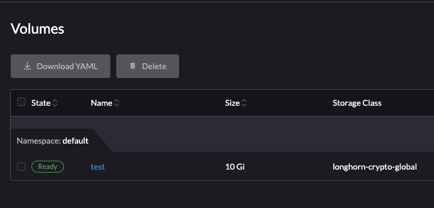

And I can confirm within Longhorn that this PVC encrypted

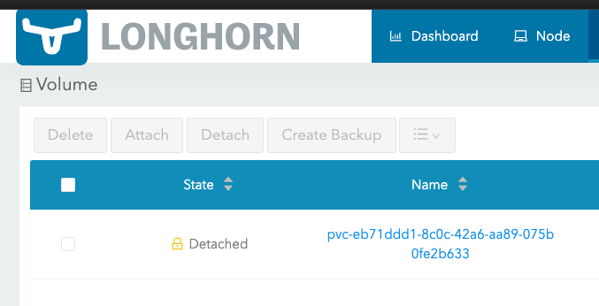

This object is a block storage type but the process and example is identical for container, I just need a different PVC created
```console
> kc apply -f yaml/pvc_test_container.yaml
persistentvolumeclaim/test-container created
```

Instead of using the Harvester UI I can verify via the embedded Rancher UI that this volume is running:

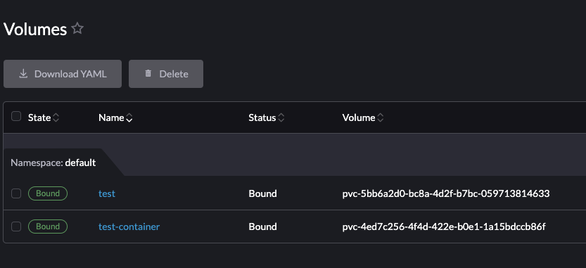

Again I can view this in the Longhorn UI as well:

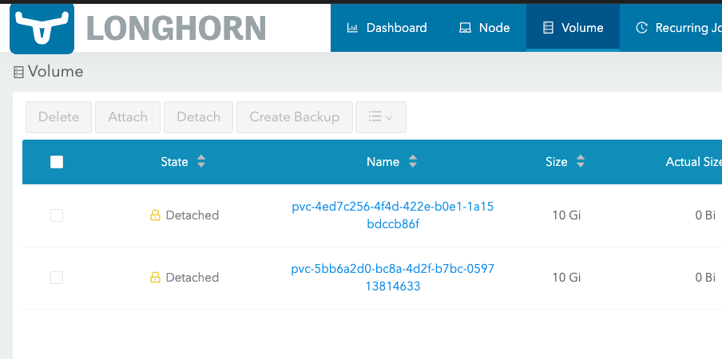


### Encryption of Additional Volumes
For the additional volume case, I can spin up a VM instance and add an additional volume to it.

First I'll create an Ubuntu-20.04 base image using the upstream Canoncial cloud image:
```console
> kc apply -f vmi.yaml
virtualmachineimage.harvesterhci.io/ubuntu-2004 created
```

I can verify this image exists via the Harvester UI:

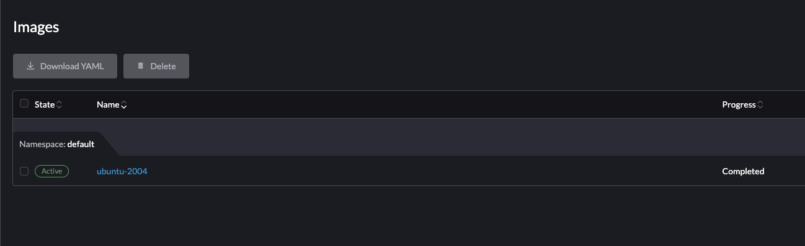

Now I can create a VM based on this root image and go to the Volume section and add the block volume I created earlier:

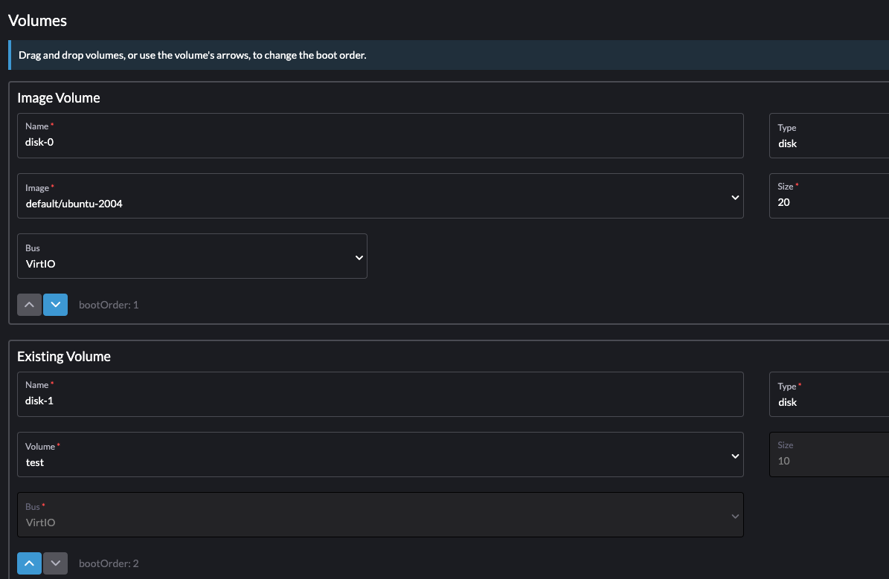

Once I click `Create` the VM base image storage class will be used to create the root filesystem for the VM and the additional volume will also be mounted.

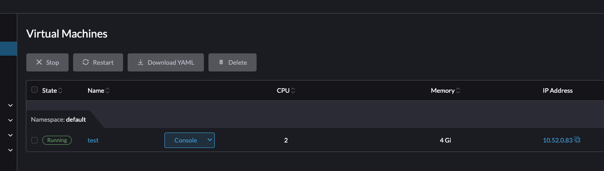

I can verify the volumes have attached via the Longhorn UI. The first volume is unencrypted and is the root filesystem. The third in the list is the second volume and is encrypted.

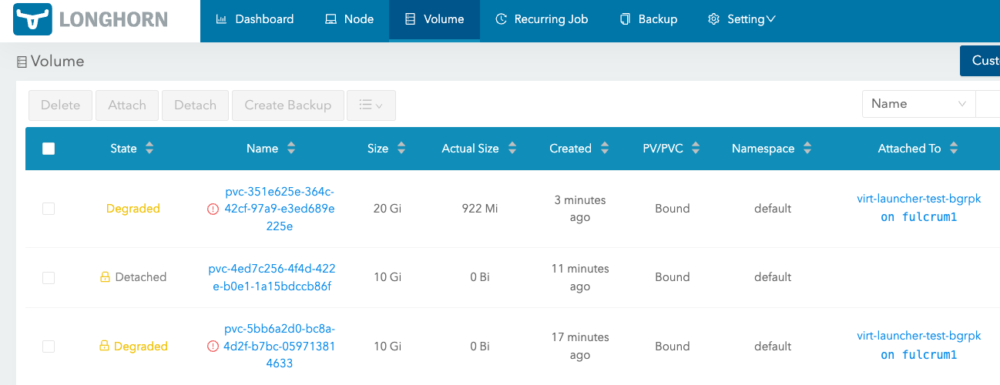

### Encryption failing for VM root filesystems

The last case does not work but required a bit of analysis of the `VirtualMachineImage` object mentioned earlier. Within the [VMI](yaml/vmi.yaml) we can see a few fields that are implicitly passed to the resulting `StorageClass` created as a result of the VMI object being created.

```yaml
spec:
  storageClassParameters:
    migratable: 'true'
    numberOfReplicas: '3'
    staleReplicaTimeout: '30'
```

I'm going to attempt to create a [new VM image](yaml/vmi-encrypted.yaml) and place the same paramters added to the `longhorn-crypto-global` storage class created earlier. The result is below:

```yaml
spec:
  storageClassParameters:
    migratable: 'true'
    numberOfReplicas: '3'
    staleReplicaTimeout: '30'
    encrypted: "true"
    csi.storage.k8s.io/provisioner-secret-name: "longhorn-crypto"
    csi.storage.k8s.io/provisioner-secret-namespace: "longhorn-system"
    csi.storage.k8s.io/node-publish-secret-name: "longhorn-crypto"
    csi.storage.k8s.io/node-publish-secret-namespace: "longhorn-system"
    csi.storage.k8s.io/node-stage-secret-name: "longhorn-crypto"
    csi.storage.k8s.io/node-stage-secret-namespace: "longhorn-system"
```

Here's the result of creation:

```console
> kc apply -f yaml/vmi-encrypted.yaml
virtualmachineimage.harvesterhci.io/ubuntu-2004-encrypted created
> kc get virtualmachineimage
NAME                    DISPLAY-NAME            SIZE        AGE
ubuntu-2004             ubuntu-2004             641400832   31m
ubuntu-2004-encrypted   ubuntu-2004-encrypted   641400832   61s
```

While the image created successfully, when I peer into the `StorageClass` that gets created as a result of this process, I can see the parameters I passed to it were dropped:

```console
> kc get storageclass
NAME                             PROVISIONER          RECLAIMPOLICY   VOLUMEBINDINGMODE   ALLOWVOLUMEEXPANSION   AGE
harvester-longhorn (default)     driver.longhorn.io   Delete          Immediate           true                   19h
longhorn                         driver.longhorn.io   Delete          Immediate           true                   19h
longhorn-crypto-global           driver.longhorn.io   Delete          Immediate           true                   40m
longhorn-ubuntu-2004             driver.longhorn.io   Delete          Immediate           true                   32m
longhorn-ubuntu-2004-encrypted   driver.longhorn.io   Delete          Immediate           true                   2m34s
> kc get storageclass longhorn-ubuntu-2004-encrypted -o yaml
allowVolumeExpansion: true
apiVersion: storage.k8s.io/v1
kind: StorageClass
metadata:
  creationTimestamp: "2023-11-02T13:08:50Z"
  name: longhorn-ubuntu-2004-encrypted
  resourceVersion: "997696"
  uid: 69232a34-992a-4b94-96a2-091b2f18d175
parameters:
  backingImage: default-ubuntu-2004-encrypted
  migratable: "true"
  numberOfReplicas: "3"
  staleReplicaTimeout: "30"
provisioner: driver.longhorn.io
reclaimPolicy: Delete
volumeBindingMode: Immediate
```

If we look at the one we created in the pre-step for comparison, specifically the parameter field, we can see what we expected (and that is not there):

```console
> kc get storageclass longhorn-crypto-global -o yaml | yq .parameters
csi.storage.k8s.io/node-publish-secret-name: longhorn-crypto
csi.storage.k8s.io/node-publish-secret-namespace: longhorn-system
csi.storage.k8s.io/node-stage-secret-name: longhorn-crypto
csi.storage.k8s.io/node-stage-secret-namespace: longhorn-system
csi.storage.k8s.io/provisioner-secret-name: longhorn-crypto
csi.storage.k8s.io/provisioner-secret-namespace: longhorn-system
encrypted: "true"
fromBackup: ""
numberOfReplicas: "3"
staleReplicaTimeout: "2880"
```

When using this storageclass either manually via volume creation, or by creating a VM instance, the volume created does not show to be encrypted:

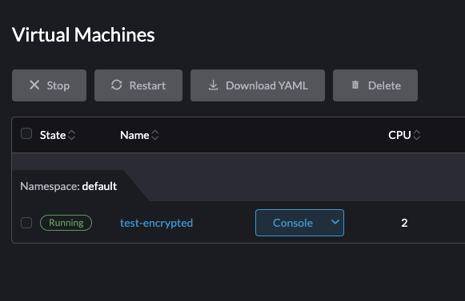

And Longhorn UI:

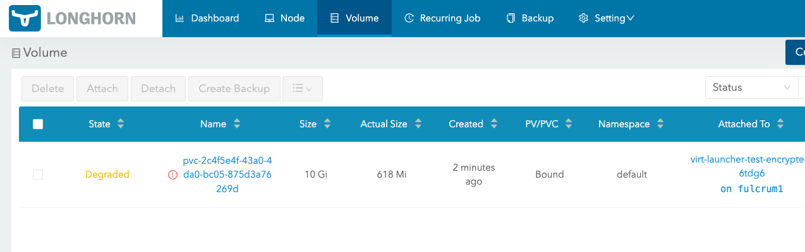

### Hacking the Gibson

Unfortunately, the process would normally stop here. While the easy answer would be modifying the `StorageClass` object itself, they are immutable by their nature making that impossible. 

However, that does not prevent us from cloning it to use the same backing image. I've copied the resulting storage class and [modified it](yaml/storageclass_hack.yaml) so I can create a new one.

The trouble with just cloning it is that Harvester ALSO needs a VMI image to tie the VM to the storage class, think of it as a binding class. Given that, there's no reason we can't just DELETE the old `StorageClass` and replace it.

```console
> kc delete sc longhorn-ubuntu-2004-encrypted
storageclass.storage.k8s.io "longhorn-ubuntu-2004-encrypted" deleted
> kc apply -f yaml/storageclass_hack.yaml
storageclass.storage.k8s.io/longhorn-ubuntu-2004-encrypted created
```

So far so good. Nothing is amiss in the VM Images upon inspection. I'll now create a new VM using this VMI.

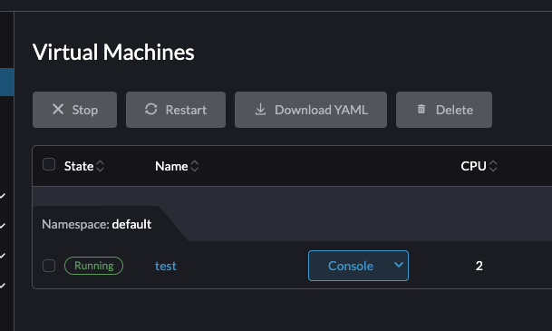

The VM created successfully using the encryption-enabled `StorageClass`. Now inspecting the Longhorn UI we can see the root volume is encrypted!!! Our tweak was successful!

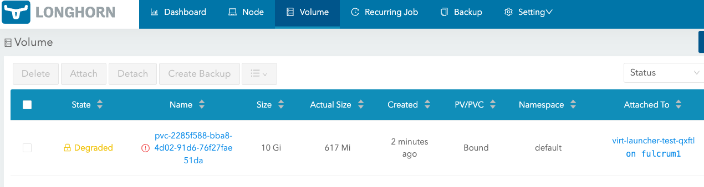


# Requests

From a customer perspective, the final product for this feature does need to have some UI elements. But if there are no major blockers, just enabling the passing of the `storageClassParameters` field to enable encryption within Longhorn for the VM root volume would be an amazing feature even if listed as experimental. 

It does appear based on the hack above that passing the parameters properly from VMI to SC will 'just work'.